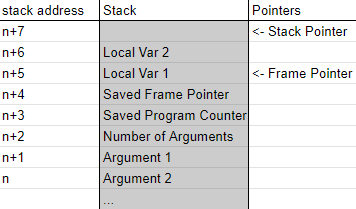

# VirtualMachine
An implementation of a stack-based VM with a compiler for a java-like language.
## The Machine 
### Overview
The machine is a simple stack-based virtual machine. All data and instructions are integers. Booleans are assigned 1 as true and 0 as false. The machine has 4 major components: Program Memory, Global Memory, Stack Memory, and Registers.  
* Program memory is the set of instructions for the machine to run. It is an array of integers that correspond to an instruction set and arguments for those instructions (e.g. [20,1] stores the top of the stack as global variable 1).  
* Global Memory stores variables that are accessible everywhere in a program.  
* Stack Memory stores data not held in variables and local variables.  
* Registers are a set of integers that store information about the state of the machine. There are 5: the program counter (pc), stack pointer (sp), frame pointer (fp), and two registers for executing operations (a and b). The pc stores the index of the next instruction to execute in program memory. The stack pointer points to the address above the top of the stack. The frame pointer points to the address in the stack that corresponds to the current function call. The a and b registers are used to store data while in the middle of an operation. For example, when adding two numbers the top two items on the stack are popped off and stored in a and b, then the sum is pushed onto the stack.
### Function Calls and Local Variables
Function calls are the most complicated operation in the machine. They need to store the data of the previous call and set up space in the stack for their local variables. In this implementation function arguments are pushed to the stack before the function is called. The CALL operation saves the pc, fp, and number of arguments and then moves the stack pointer to add space for the local variables.   
  
The RET operation removes everything on the stack down to and including the arguments. It preserves the top item of the stack.  
LOADing local variables uses the frame pointer as an anchoring index and uses the argument as an offset. Arguments are accessed by using negative offsets.  
If a local variable is STOREd with a higher offset than number of locals pre-allocated or lower offset than number of arguments pre-allocated then other data on the stack will be overwritten.
### Instruction Set
This is the instruction set for the machine.The number of the list is the code for the instruction. The name of the instruction is in all caps followed by any arguments and then a description of the operation.
1. **ADD**: adds the top two numbers on the stack and pushes the result
2. **SUB**: subtracts the top two numbers on the stack and pushes the result
3. **MUL**: multiplies the top two numbers on the stack and pushes the result
4. **DIV**: divides the top two numbers on the stack and pushes the result
5. **LT**: compares the top two numbers on the stack (a,b) and pushes 1 if a < b and 0 otherwise
6. **GT**: compares the top two numbers on the stack (a,b) and pushes 1 if a > b and 0 otherwise
7. **LEQ**: compares the top two numbers on the stack (a,b) and pushes 1 if a <= b and 0 otherwise
8. **GEQ**: compares the top two numbers on the stack (a,b) and pushes 1 if a >= b and 0 otherwise
9. **EQ**: compares the top two numbers on the stack (a,b) and pushes 1 if a = b and 0 otherwise
10. **AND**: pushes 1 to the stack if both of the top two items are both 1 and 0 otherwise
11. **OR**: pushes 1 to the stack if either of the top two items are both 1 and 0 otherwise
12. **NOT**: pushes 0 if the top of the stack is 1 and 1 if the top of the stack is 0
13. **JMP** *addr*: jumps the pc to the address specified by *addr*
14. **JMPT** *addr*: jumps the pc to the address specified by *addr* if the top of the stack is 1
15. **JMPF** *addr*: jumps the pc to the address specified by *addr* if the top of the stak is 0
16. **CONST** *number*: pushes *number* onto the stack
17. **LOAD** *idx*: loads the local variable at index *idx* (use negative numbers to access arguments when in a function)
18. **GLOAD** *idx*: loads the global variable at index *idx*
19. **STORE** *idx*: stores the top of the stack at local memory address *idx*
20. **GSTORE** *idx*: stores the top of the stack at global memory address *idx*
21. **PRINT** prints the top of the stack to the console
22. **POP** discards the top of the stack
23. **HALT** stops the machine (**MUST BE AT THE END OF EVERY PROGRAM!**)
24. **CALL** *addr* *nArgs* *nLocals*: calls the function at address *addr* (this is covered more in the Function calls section)
25. **RET**: returns from inside a function. The top of the stack is kept but the rest of the stack for the function call (including the arguments) are discarded
26. **NEG**: multiplies the top of the stack by -1
27. **MOD**: divides the top two numbers on the stack and pushes the remainder
### Bytecode
Programs written as lists of integers are hard to read and write. Therefore, this project also includes a compiler from bytecode to the machine's code. Instructions are referenced by their name rather than their code. E.g. "GT" rather than "6". This level of code is useful for debugging the machine with simple programs but is extremely prone to bugs and is slow to write. Because of this, this project includes a higher-level language which is modeled after java.
## Java-like language
This project includes a Parser and Lexer for a language that is similar to java. It supports functions, if statements, and loops. Variables are not typed because in the machine everything is an integer. Single-line comments use # and multi-line comments use /** to start and */ to end. It does not support objects or classes.   
```java
/**
 * factorial function!
 */
func factorial(n){
    if(n<=1){
        return 1;
    }
    return n*factorial(n-1);
}
x = 3;
print(factorial(x));
``` 
### Grammar
The BNF form for the grammar can be found in [grammarBNF.txt](grammarBNF.txt).
### Parser
The parser for this language is a top-down parser with backtracking. 
## Usage
Clone this repository, import it to an IDE, and run the Machine class with the arguments 
```bash
runSrc ./src/parserTest.vsrc
```
## File types
This project uses several custom file extensions:
* .vcomp: fully compiled programs for the VM
* .vbyt: bytecode that needs to be processed by the Compiler before being run
* .vsrc: Java-like sourcecode that can be converted to a .vbyt file by the Lexer and Parser
* .vlex: the result of lexxing a .vsrc file. Used by the Parser to create a .vbyt file